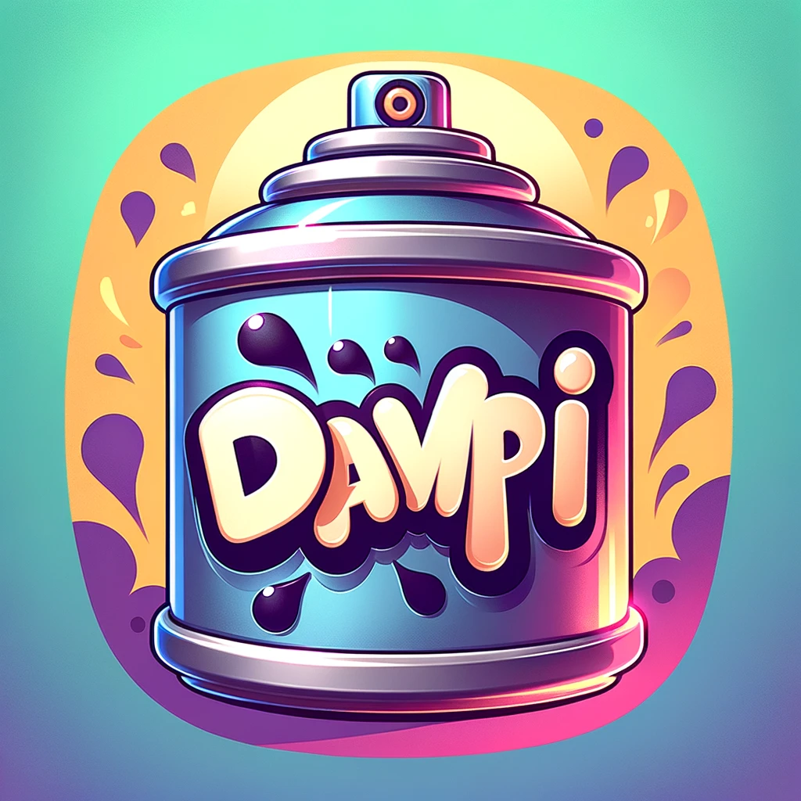

  
  

    
  

  <h1>
    hey there, i'm David
    
  </h1>

## 👨‍💻 Who I Am
As a dedicated Computer Science student in my final semester, I'm deeply immersed in coding and computer science. Based in Genova, Italy, my journey in tech has led me to proficiency in Python, C++, C, Java, and OCaml. Currently, I'm focused on mastering Rust.

- 🌟 Main focus: Deepening expertise in Rust for software development.
- 🌐 Expanding skills in: JavaScript, PHP, HTML, CSS
- 🤖 Enthusiastic about: Artificial Intelligence, diverse programming languages and paradigms and SBM Programming

## 🛠 Tech Stack

- 💻 &nbsp; Python | C | C++ | Java | OCaml | **Rust**
- 🌐 &nbsp; JavaScript | PHP | HTML | CSS
- 🚀 &nbsp; AI & Arduino | Low-level Programming

## 📈 Current Projects

- **DOPE Aerospace's Systems & Avionics**: As Team Leader, I'm deeply involved in the development of advanced Arduino-based flight controll systems for aerospace applications. My role encompasses designing and programming intricate sensor networks and wireless communication systems, essential for the real-time monitoring and control of aerospace equipment. [DOPE Aerospace LinkedIn](https://www.linkedin.com/company/dope-aerospace-unige/)
- **Linux Utility Stack in Rust**: Reimplementing common Linux utilities in Rust to deepen understanding of it's working and learning the linguage.
- **Beehive Monitoring System**: Developing a real-time monitoring system for beehives, integrating sensor data for health and productivity analysis with automated alert systems.

## 📊 GitHub Stats

  
    

div>
## 📫 Reach Me

- LinkedIn: [David Hermes LinkedIn](https://www.linkedin.com/in/david-hermes-46168226a)
- Email: dhermes.mail@web.de (I often forget to check my emails)

## ⚡ Fun Fact

- I am a D&D Dungeon Master after two homebrew campaigns i'm now dming Curse of Stradh. 
- I'm German, but I live in Italy and get easly offended when people start calling me _deivid_ or _devid_ thinking i'm _British_.

<!-- Proudly created by David Hermes with passion and chatGPT <3 -->
